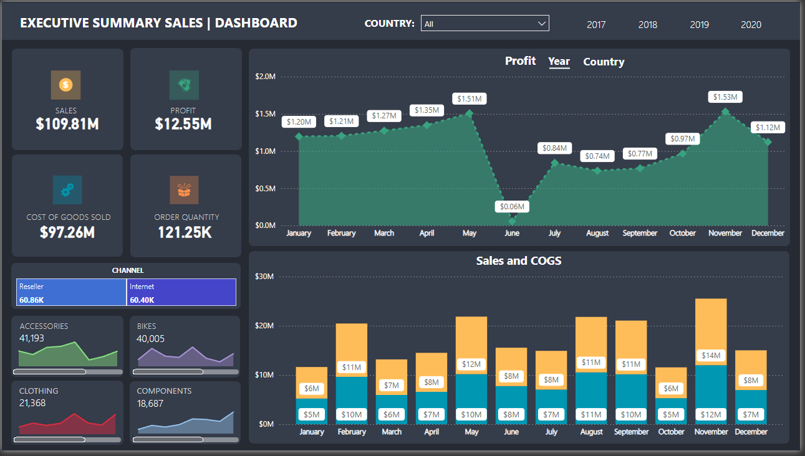

📊 **AwSales Dashboard: Data Visualization for Strategic Sales Management (Power BI)** 🌐

  Imagine a data visualization tool that empowers informed sales decisions. The AwSales Dashboard, built using Power BI, is a comprehensive platform I designed to deliver actionable insights for global sales teams. It goes beyond traditional sales tracking, providing a clear picture of what's driving sales success across markets and product lines.

**Key Features**

📌Interactive Sales Analytics: I leveraged Power BI's functionalities to create interactive visualizations that allow users to drill down into top sales figures by country. This enables identification of high-performing markets, analysis of trends, and strategic planning for continued growth. 

📌Product Performance Deep Dives: The dashboard features a dedicated section showcasing the highest-selling products, offering valuable insights into consumer preferences and market demand. This empowers informed product development and marketing strategies. 

📌Profitability & Growth Tracking: I designed financial dashboards that visualize annual profits, allowing users to track growth trajectories and pinpoint opportunities for optimization. This empowers data-driven decisions to maximize profitability. 

📌Customer Journey Mapping: By analyzing preferred order line channels, the dashboard provides insights into customer behavior. This understanding allows for a more customer-centric approach, ensuring you reach and engage your audience effectively. 

🌐 Benefits:

1.) Strategic Decision-Making: Real-time data empowers users to optimize resource allocation, refine marketing strategies, and drive sustainable sales growth. 

2.) Data-Driven Optimization: The dashboard provides clear insights to identify areas for improvement and maximize profitability. 

3.) Enhanced Customer Focus: Understanding customer preferences allows for a more targeted sales approach, leading to increased customer satisfaction and loyalty. 

📖 Dataset: [GitHub](https://github.com/microsoft/powerbi-desktop-samples/blob/main/AdventureWorks%20Sales%20Sample/AdventureWorks%20Sales.xlsx)

📈 Dashboard: 

